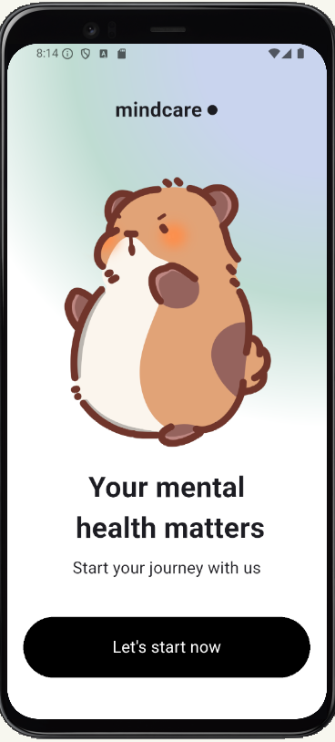
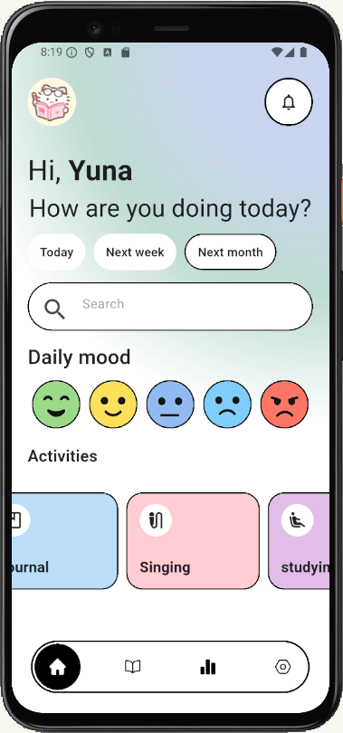

# daily_mood_app

This is a simple flutter UI project that focused on mental awareness and mood tracking design.

## Overview

"DailyMood" is a flutter application that created as UI concept project.
The app showcase a multiple screen layouts such as onBoarding, moodTracking, and journaling pages.

## Final screen and App features

**On boarding screen with start button to moodTracking page.**

**MoodTracking as a home screen, with time selection, search bar, daily mood check, and activity box.**

**journaling page after click the activities box.**

## 🖼️ Design Reference

This UI design was inspired by:
Mental Health Support App - Dribbble.
Source link (https://dribbble.com/shots/26481307-Mental-Health-Support-App).

*All design credit belongs to the original creator.*

👩‍💻 Developer

Created by Cantika Kesyanda Praja

 @CantikaPraja
